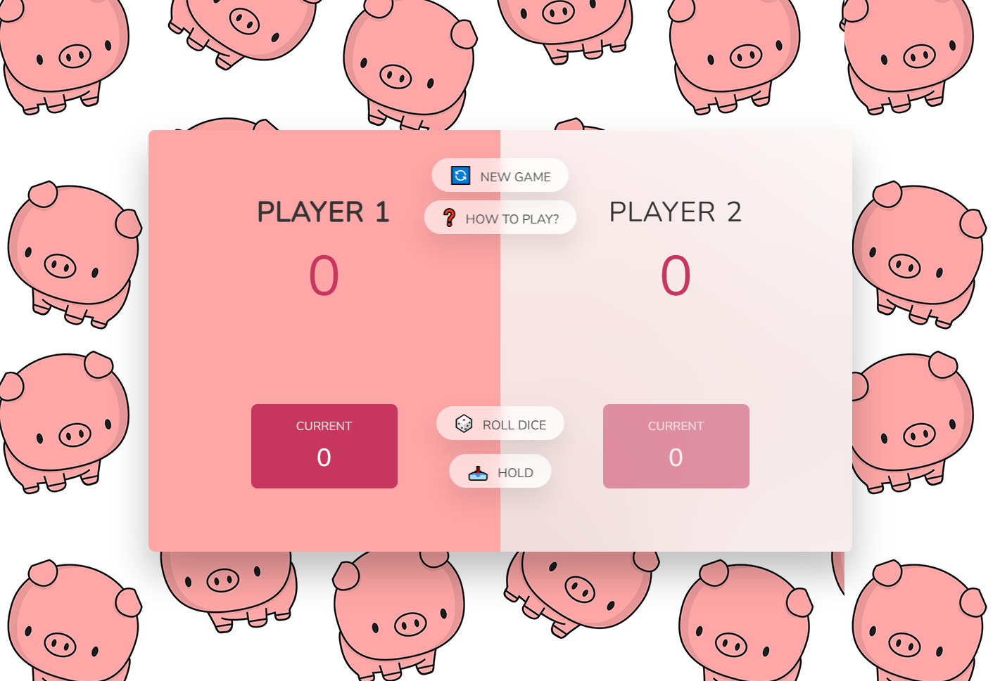

## Welcome! 👋

Thanks for checking out this mini project
This is a simple web application showcasing my command of HTML, CSS and Javascript.

## The challenge

The main challenge here creating a solid game logic and implementing it through Javascript

## Gameplay 🎮

Each turn, a player repeatedly rolls a die until either a 1 is rolled or the player decides to "hold".

- If the player rolls a 1, they score nothing and it becomes the next player's turn.
- If the player rolls any other number, it is added to their turn total and the player's turn continues.
- If a player chooses to "hold", their turn total is added to their score, and it becomes the next player's turn.
  The first player to score 100 or more points wins.

## Features

- Error handling
- Score tracking
- High Score retention
- Reset button
- 2 player turn based logic

## Technologies used

- HTML - Used to create the index.html file
- CSS - Used to design the webpage
- Javascript - Used for app's logic implementation
- VSCode - IDE I used to create the web app
- Git - For version control
- Netflify - Used to host this web app

## Preview

## Deployment

You may visit the deployed web app through the link below.

- [https://amiralles-piggame.netlify.app/](https://amiralles-piggame.netlify.app/)

## Footer

Thank you for taking the time in checking out this repository.
**Argel Miralles | Full Stack Web Developer**  
**SIC PARVIS MAGNA**☝
